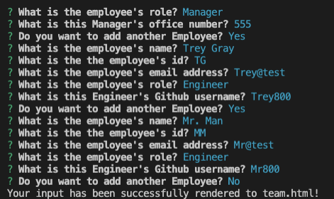
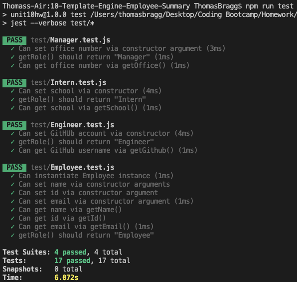
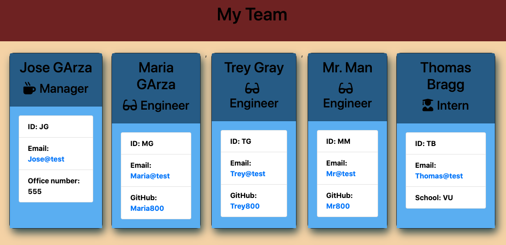

# 10-Template-Engine-Employee-Summary

##  Repository: 
[go](https://github.com/TBragg800/10-Template-Engine-Employee-Summary){:target="_blank"}

## Walkthrough Video Demonstration: 

YouTube link to the walkthrough:
[go](https://www.youtube.com/watch?v=yOWRzRj2rBA&feature=youtu.be){:target="_blank"}

## Table of Contents
  [Description](#Description)

  [Installation](#Installation)

  [Usage](#Usage)

  [License](#License)

  [Contributing](#Contributing)

  [Tests](#Tests)

  [Questions](#Questions)
  
## Description
  This project is a Template Engine CLI application that utilizes node.js to dynamically generate a 'team.html' file to the user through a series of prompts by way of the Inquirer package. The answers are then formatted to display a quick and professional Team Roster.

## Installation
* Using the CLI, the user should navigate to the project directory and run 'npm install'.
* Note: The jest npm is utilized as a devDependency.

## Usage
  After installation, the user should run 'node app.js' in the CLI, then answer the following prompts.

## License
  MIT License

Copyright (c) [2020] [Thomas Bragg]

Permission is hereby granted, free of charge, to any person obtaining a copy
of this software and associated documentation files (the "Software"), to deal
in the Software without restriction, including without limitation the rights
to use, copy, modify, merge, publish, distribute, sublicense, and/or sell
copies of the Software, and to permit persons to whom the Software is
furnished to do so, subject to the following conditions:

The above copyright notice and this permission notice shall be included in all
copies or substantial portions of the Software.

THE SOFTWARE IS PROVIDED "AS IS", WITHOUT WARRANTY OF ANY KIND, EXPRESS OR
IMPLIED, INCLUDING BUT NOT LIMITED TO THE WARRANTIES OF MERCHANTABILITY,
FITNESS FOR A PARTICULAR PURPOSE AND NONINFRINGEMENT. IN NO EVENT SHALL THE
AUTHORS OR COPYRIGHT HOLDERS BE LIABLE FOR ANY CLAIM, DAMAGES OR OTHER
LIABILITY, WHETHER IN AN ACTION OF CONTRACT, TORT OR OTHERWISE, ARISING FROM,
OUT OF OR IN CONNECTION WITH THE SOFTWARE OR THE USE OR OTHER DEALINGS IN THE
SOFTWARE.

## Contributing
  Fork the project & clone locally. Create an upstream remote and sync your local copy before you branch. Branch for each separate piece of work. Do the work, write good commit messages, and read the CONTRIBUTING file if there is one. Push to your origin repository. Create a new PR in GitHub.

## Tests
  There are are 4 test suites with a total of 17 tests by way of the jest npm. After following the installation instructions, type "npm run test" into your CLI.

## Questions
  All questions should be submitted to the email listed below. Please consult the GitHub profile or Repo for additional concerns. 
  Email: Ttbbragg83@gmail.com
  Github: [TBragg800] (http://github.com/TBragg800)

## Screenshot of deployed application
